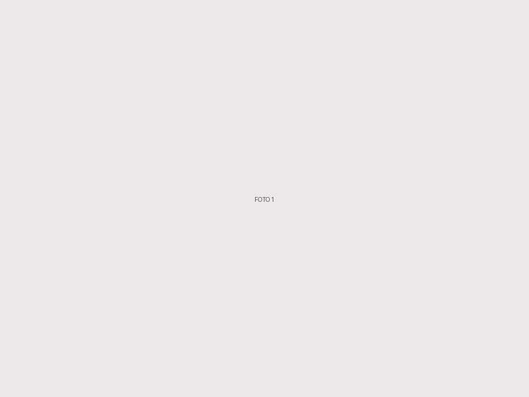
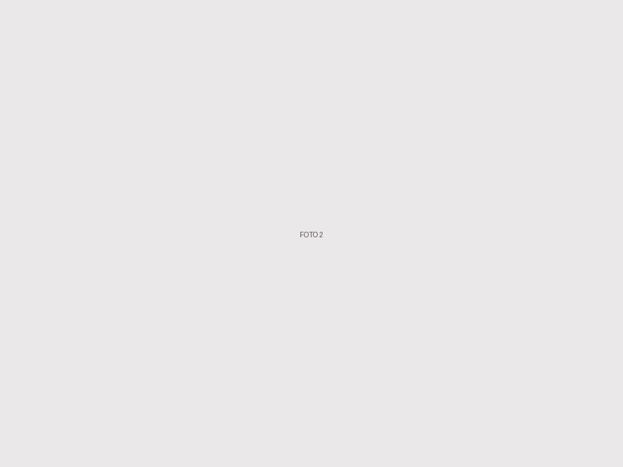
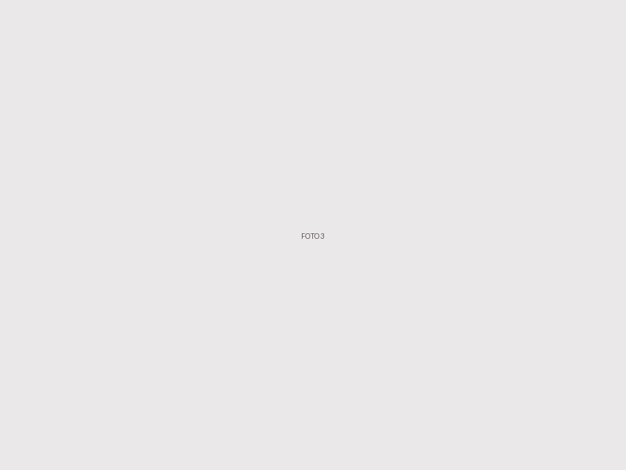

::: {.hero-section}
::: {.hero-content}

Zangkoor in 

# Samen zingen. Samen muziek maken.

**** is een koor uit . 

[Kom een keer meezingen](meezingen.qmd){.btn .btn-primary .btn-lg} [Leer ons kennen](over-ons.qmd){.btn .btn-outline-primary .btn-lg}
:::

::: {.hero-photo}
}}" class="hero-image">
:::
:::

::: {.content-band}
## Welkom bij 

Of je nu al jaren zingt of voor het eerst in een koor wilt stappen: bij ons draait het om samen muziek maken, plezier in zingen en werken aan mooie optredens.

::: {.feature-grid}
::: {.feature-card}
### 🎵 Ons repertoire
We zingen .

[Meer over ons →](over-ons.qmd)
:::

::: {.feature-card}
### 👥 Nieuwe leden welkom
Nieuwsgierig of het koor bij je past? Kom vrijblijvend een repetitie bijwonen of direct een keer meezingen.

[Zo werkt meezingen →](meezingen.qmd)
:::

::: {.feature-card}
### 🎭 Optredens
Bekijk waar we binnenkort optreden en lees terugblikken op eerdere concerten.

[Bekijk optredens →](optredens.qmd)
:::
:::
:::

::: {.recruitment-band}
::: {.recruitment-inner}
## Zin om mee te zingen?

We repeteren iedere ** van ** in .

[Ik wil een keer meezingen](meezingen.qmd){.btn .btn-light .btn-lg}
:::
:::

::: {.content-band}
## Een indruk van ons koor

::: {.gallery-grid}
}} tijdens een optreden" class="gallery-image">
}} tijdens een repetitie" class="gallery-image">
}} als groep" class="gallery-image">
:::

[Bekijk onze eerdere optredens →](optredens.qmd)

:::
